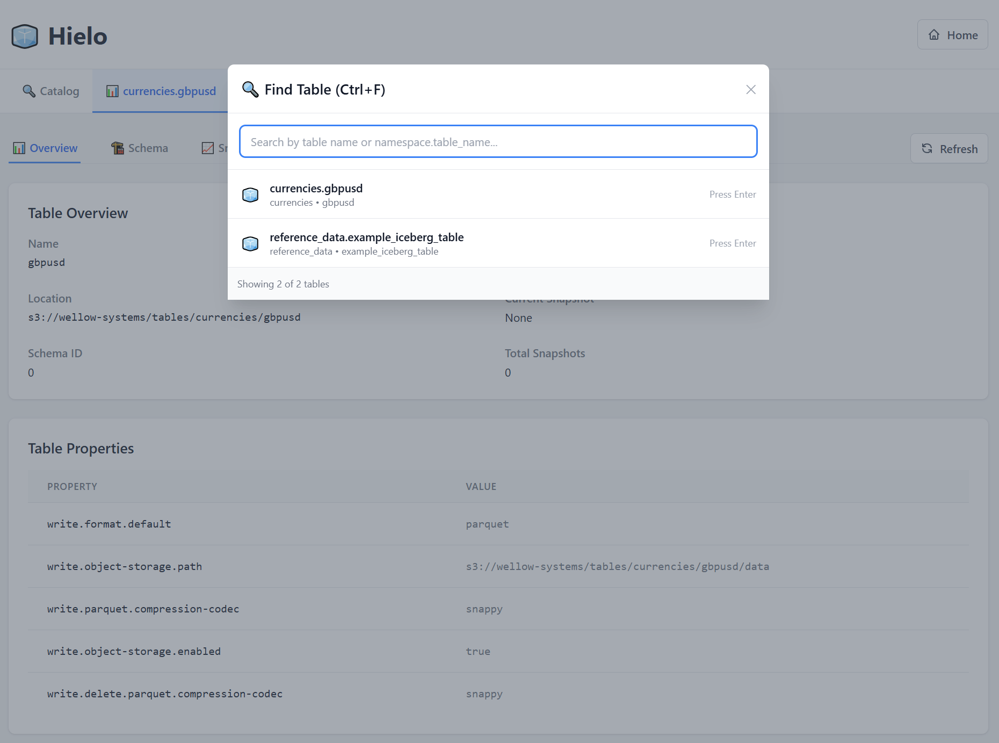
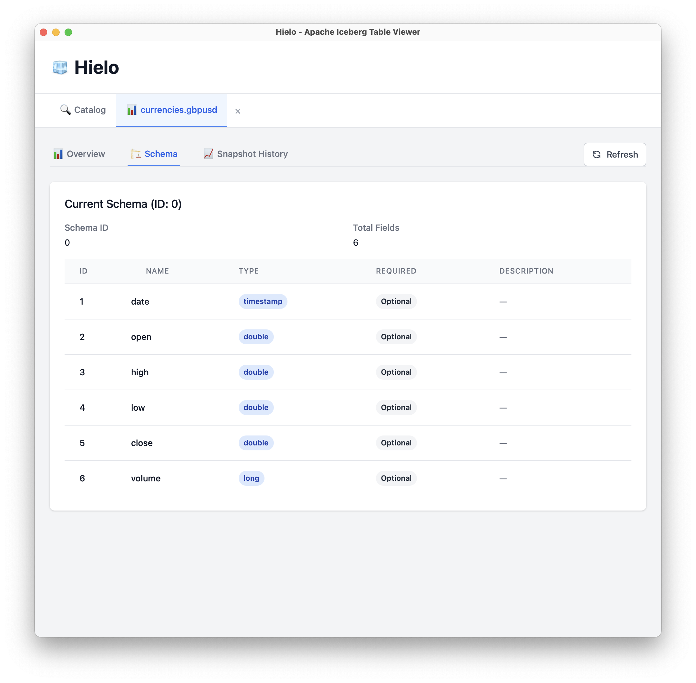
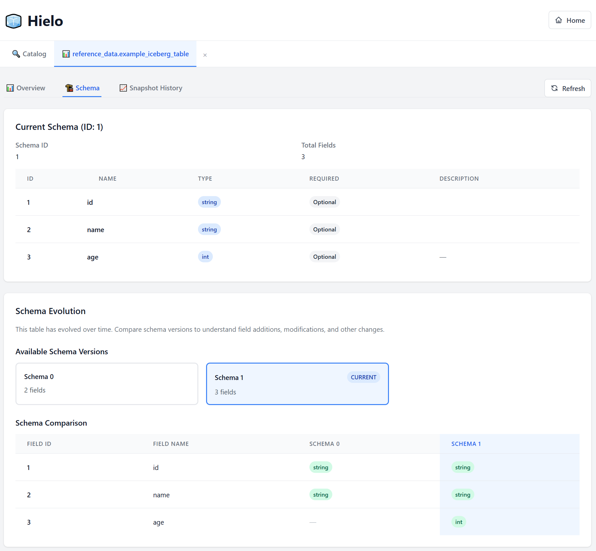
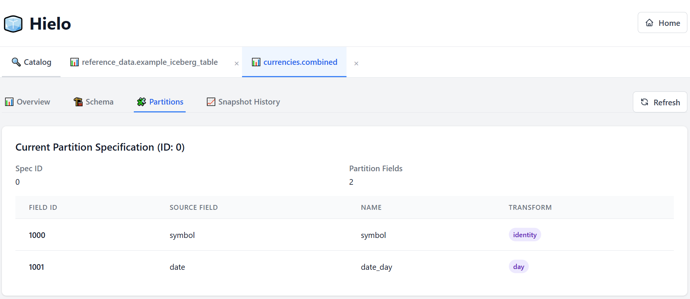
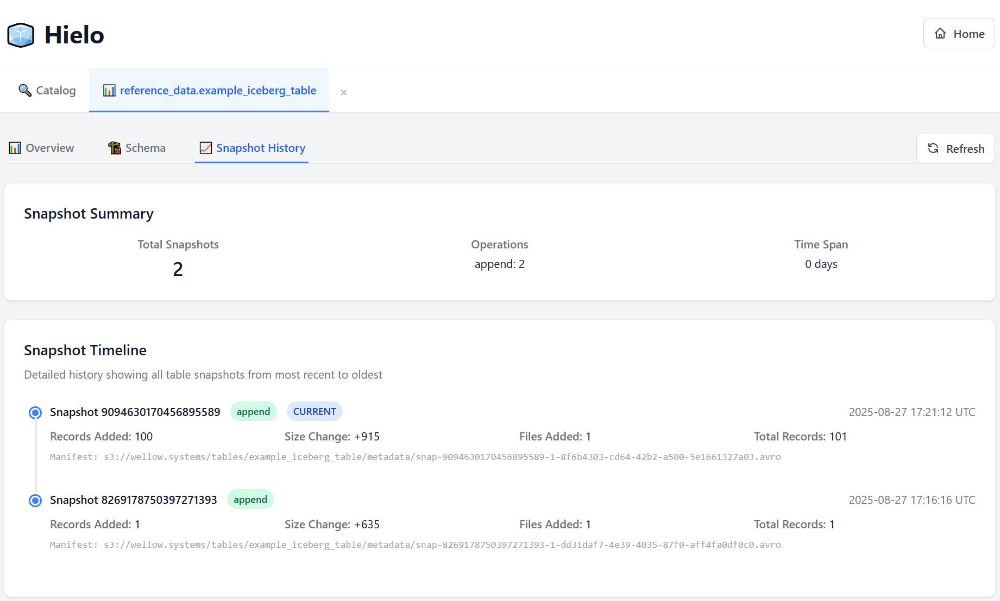

# 🧊 Hielo

A modern, native desktop application for visualising Apache Iceberg table metadata and snapshot history.
Built with Rust and Dioxus for performance and cross-platform compatibility.

*Hielo* (Spanish for "ice") is a lightweight, fast tool for exploring your Iceberg tables.

## Features

- **🔗 Multiple Catalog Support**: Connect to REST and AWS Glue catalogs
- **📋 Schema Visualisation**: Explore table schemas with nested field support
- **🔄 Schema Evolution**: Compare schema changes across versions
- **🧩 Partition Management**: View partition specifications and transform functions
- **📈 Snapshot Timeline**: Track table history with detailed operation information
- **🚀 Cross-Platform**: Native binaries for Linux, macOS, and Windows

## Screenshots

### Table Overview
Get a comprehensive view of your table metadata, including location, snapshot information, and table properties.


*Clean overview of table metadata with key information at a glance*

### Schema Visualisation
Explore your table schema with detailed field information, types, and documentation. View schema evolution over time with side-by-side comparisons.


*Detailed schema visualisation with field types, requirements, and descriptions*


*Schema evolution comparison showing field changes across versions*

### Partition Management
Visualize table partitioning strategies with detailed partition field information and transform functions.


*Partition specification details with transform functions and source field mapping*

### Snapshot Timeline
Track your table's history with a detailed timeline of all snapshots, including operation types, record counts, and file changes.


*Comprehensive snapshot timeline with operation details and statistics*

## Installation

### Pre-built Binaries

Download the latest release for your platform from the [Releases](../../releases) page:

- **Linux x86_64**: `hielo-linux-x86_64`
- **Linux ARM64**: `hielo-linux-aarch64`
- **macOS x86_64**: `hielo-macos-x86_64`
- **macOS ARM64**: `hielo-macos-aarch64`
- **Windows x86_64**: `hielo-windows-x86_64.exe`

### Building from Source

#### Prerequisites

- Rust 1.70+ (install via [rustup](https://rustup.rs/))
- Platform-specific dependencies:

**Linux (Ubuntu/Debian)**:
```bash
sudo apt-get install libgtk-3-dev libwebkit2gtk-4.0-dev libappindicator3-dev librsvg2-dev patchelf
```

**macOS**:
```bash
# Xcode command line tools (if not already installed)
xcode-select --install
```

**Windows**:
- WebView2 (usually pre-installed on Windows 10/11)
- Visual Studio Build Tools or Visual Studio with C++ tools

#### Build Commands

```bash
# Clone the repository
git clone https://github.com/atcol/hielo.git
cd hielo

# Build in release mode
cargo build --release

# Run the application
cargo run --release
```

## Development

### Running in Development

```bash
# Run with hot reload
cargo run

# Run tests
cargo test

# Check formatting
cargo fmt --check

# Run clippy lints
cargo clippy -- -D warnings
```

## License

This project is licensed under the MIT License - see the [LICENSE](LICENSE) file for details.

## Acknowledgments

- [Apache Iceberg](https://iceberg.apache.org/) for the amazing table format
- [Dioxus](https://dioxuslabs.com/) for the excellent Rust UI framework
- [Tailwind CSS](https://tailwindcss.com/) for the styling system

---
